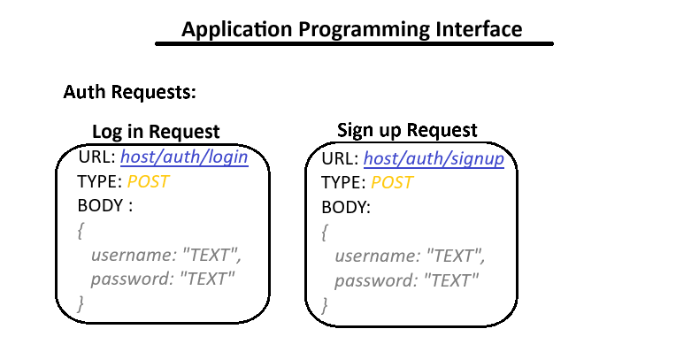
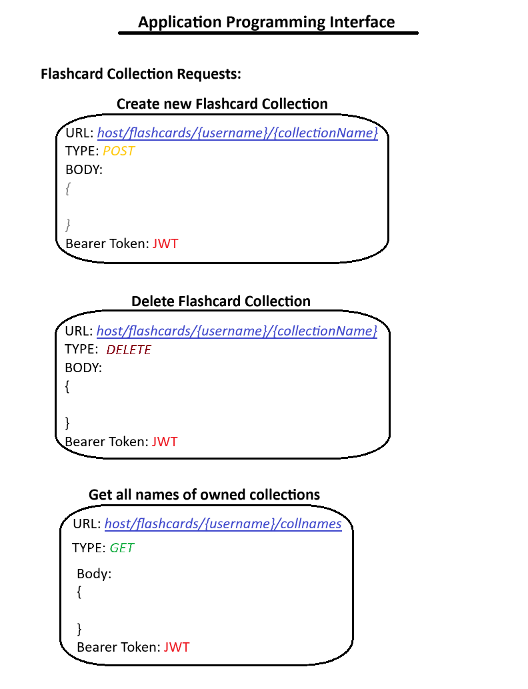
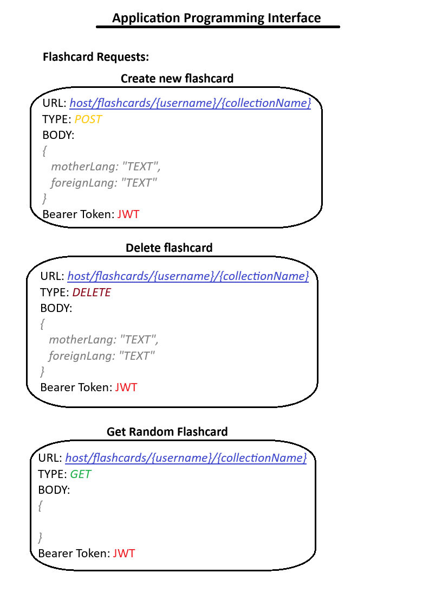
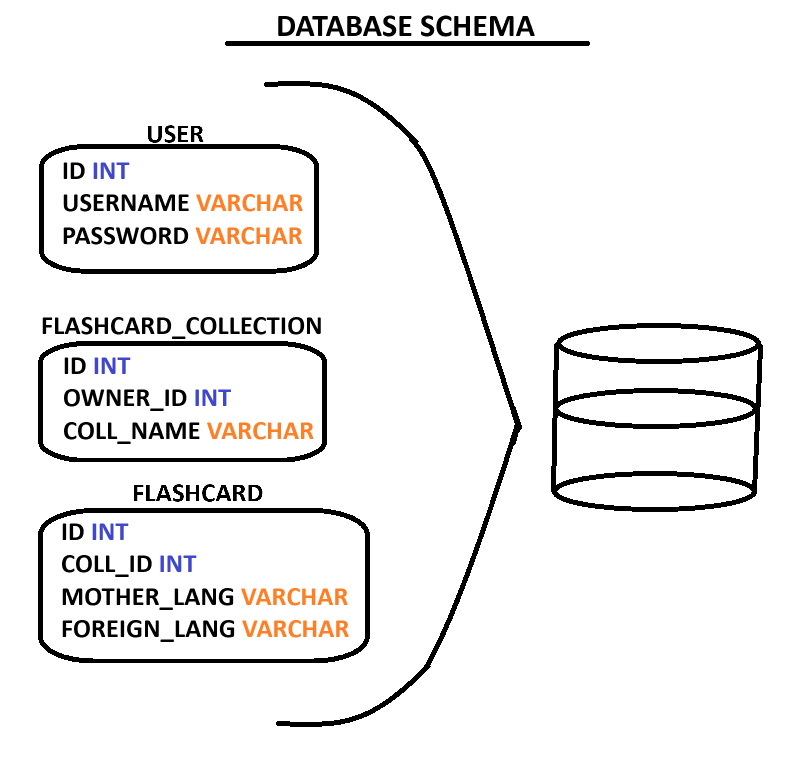
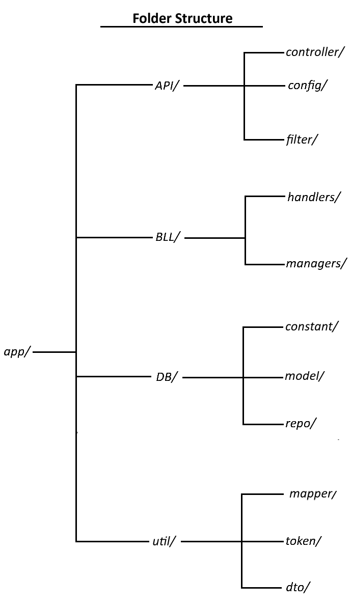

# Flashcards
Flashcards repo is an entry level project, that's been created to learn about project design and spring boot.

## Table of contents
1. [Information](#information)
2. [Requirements](#requirements)
3. [API](#api)
4. [JWT Security](#jwt-security)
5. [Database](#database)
6. [Project Structure](#project-structure)

## Information 
In complex projects, the designing and architectural skills might prove useful. We use this repo as an opportunity to develop them. Regular practice is key to success. This project can be downloaded, edited and used in any way you want.

## Requirements 
To run this program you need to meet bullet points:
- install ***Java Development Kit***;
- install ***Apache Maven***;
- add ***mvn*** to the **PATH**;

## API 
Application programming interface is a way for two computers to communicate with each other.

## JWT Security 
We use the JWT open standard to secure our application. This allows us to securely transfer information between parties as a JSON object. The token (in this case) is signed with a public/private key using the RSA algorithm. Our JWT filter checks the validity and decides about the fate of a request.

## Database 
We decided to use the MySQL database because of the GNU General Public License (GPL). The picture below shows the database structure.

## Project Structure 
Folders are divided in clear way to have an easy access to all files in the project. The clearity is key to make it work.

