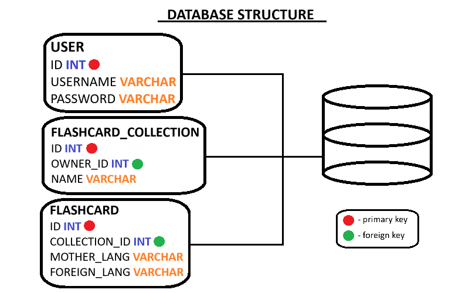

# Flashcards
Flashcards repo is an entry level project, that's been created to learn about project design and spring boot.

## Table of contents
1. [Information](#information)
2. [Requirements](#requirements)
3. [JWT Security](#jwt-security)

4. [Project Layers](#project-layers)
    - [Application Layer](#application-layer)
    - [Business Layer](#business-layer)
    - [Persistence Layer](#persistence-layer)
    - [Database Layer](#database-layer)

## Information 
In complex projects, the designing and architectural skills might prove useful. We use this repo as an opportunity to develop them. Regular practice is key to success. This project can be downloaded, edited and used in any way you want.

## Requirements 
To run this program you need to meet bullet points:
- install ***Java Development Kit***;
- install ***Apache Maven***;
- add ***mvn*** to the **PATH**;

## JWT Security 
We use the JWT open standard to secure our application. This allows us to securely transfer information between parties as a JSON object. Our JWT filter checks the validity and decides about the fate of a request.

## Project Layers 
Whole project is divided into segments that are responsible for some functionalities of an application.

### Application Layer 
An application layer is an abstraction layer that specifies the shared communication protocols and interface methods used by hosts in a communications network. 
   - **AuthConfig.java**;
   - **SecurityConfig.java**;
   - **JWTFilter.java**;
   - **AuthController.java**;
   - **FlashcardCollectionController.java**;
   - **FlashcardController.java**;

### Business Layer 
The business layer, also called the domain layer, is where the application's business logic operates. Business logic is a collection of rules that tell the system how to run an application, based on the organization's guidelines.
   - **AuthHandler.java**;
   - **FlashcardCollectionHandler.java**;
   - **FlashcardHandler.java**;
   - **HandlerException.java**;
   - **FlashcardCollectionManager.java**;
   - **FlashcardManager.java**;
   - **JWTManager.java**;
   - **UserManager.java**;
   - **DTOMapper.java**;
   - **FlashcardCollectionDTO.java**;
   - **FlashcardDTO.java**;
   - **UserDTO.java**;
   - **JsonWebToken.java**;

### Persistence Layer 
The persistence layer, also called the data access layer, acts as a protective layer. It contains the code that's necessary to access the database layer.
   - **FlashcardCollectionRepository.java**;
   - **FlashcardRepository.java**;
   - **UserRepository.java**;
   - **FlashcardCollection.java**;
   - **Flashcard.java**;
   - **User.java**;

### Database Layer 
The database layer is where the system stores all the data. It's the lowest tier in the software architecture and houses not only data but indexes and tables as well. Search, insert, update and delete operations occur here frequently.

